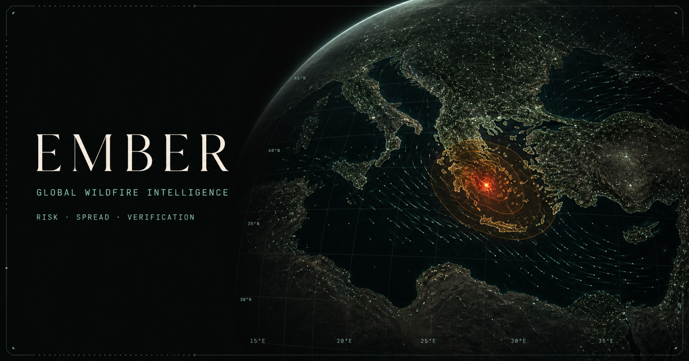
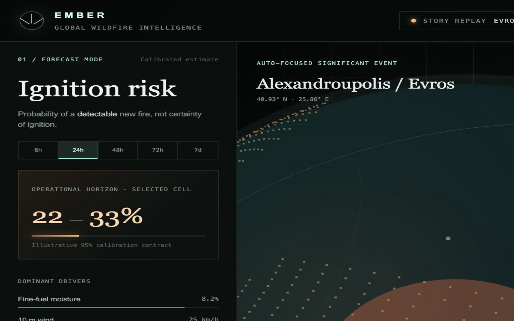
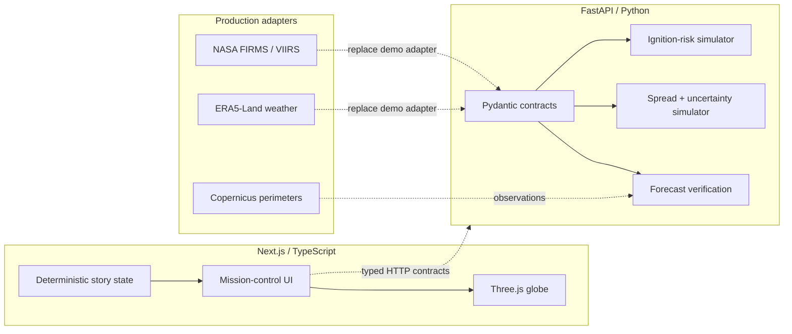

# EMBER — Global Wildfire Risk & Spread Forecasting Globe

[](https://marinjursic.github.io/global-wildfire-risk-globe/)
[](https://github.com/MarinJursic/global-wildfire-risk-globe/actions/workflows/pages.yml)



The project-specific PNG above is the repository’s **illustrated social card**, not
an application screenshot. It communicates the Evros focus, uncertainty rings, and
wind-field language and is deliberately not labeled as live data.

EMBER is a portfolio-grade, laptop-friendly research interface for two related but
scientifically distinct problems:

1. **Ignition-risk forecasting** estimates the calibrated probability of a *new
   detectable fire* in a geographic cell over 6-hour, 24-hour, 48-hour, 72-hour,
   and 7-day horizons.
2. **Active-fire spread forecasting** begins after a detection and estimates spread
   direction, arrival-time distribution, affected area, uncertainty, and exposure.

The app opens directly on a deterministic story replay inspired by the August 2023
Alexandroupolis/Evros fire in Greece. Copernicus reports it as the largest wildfire
recorded in the EU, at about 96,000 hectares. This gives a reviewer an immediately
meaningful scene without requiring credentials, a large download, or a search for an
interesting location.

> **Scientific and safety boundary:** EMBER is a research demonstration, not an
> operational fire-alert, evacuation, or incident-command system. The replay values
> and forecast surfaces are deterministic synthetic data shaped like production
> contracts. They are not current observations, are not suitable for emergency
> decisions, and do not claim to predict exact ignitions.

## Real application capture



This PNG was captured from the locally running application, after the WebGL globe
initialized. It is evidence of the executable dashboard—not a design mockup—and shows
the mission-control shell, horizon selector, interactive globe, and story replay state.
The separate social card above remains intentionally illustrative.

**How to read the capture:** the left panel answers “how likely is a detectable new
fire in this cell?”, the center globe locates the replay and overlays its front, and
the right panel answers “what could the active fire affect?”. The bottom timeline
compares each forecast frame with its later observation contract. Orange encodes
hazard/uncertainty; mint encodes environmental context and verification.

## What you can do

- Orbit an animated Three.js globe auto-focused on the Evros event.
- Switch between a high-contrast dark control-room theme and a readable daylight
  theme; the choice persists in local storage and defaults to the operating-system
  preference on first use.
- Change the ignition-risk horizon and watch cumulative probability update across
  6-hour, 24-hour, 48-hour, 72-hour, and 7-day windows.
- Toggle animated wind, temperature, soil-moisture, vegetation-dryness, VIIRS-style
  detections, uncertainty, historical-scar, and infrastructure layers.
- Play or scrub the 30-hour forecast-versus-observation replay; it auto-starts unless
  the operating system requests reduced motion.
- Compare the p50 forecast outline with the observation outline while affected area,
  settlement, road, power-line, forest, protected-area, IoU, and arrival-time metrics
  update together.
- Query typed FastAPI endpoints for risk, spread, story events, and verification.
- Inspect OpenAPI documentation and run deterministic regression tests.

### Interaction and accessibility

- Drag or swipe the globe to orbit it.
- Focus the globe and use the arrow keys to orbit; press `Home` to return to Evros.
- Use the left/right arrow keys while a horizon tab is focused to change horizon.
- Every layer control exposes an `aria-pressed` state, every icon-only control has an
  accessible name, keyboard focus is visible, and verification metrics remain
  available in the mobile layout.
- Reduced-motion preference removes automatic replay, front pulsing, and wind motion.
- If WebGL is unavailable, the app reports that condition while leaving all textual
  forecasts, controls, and metrics usable.

### Geographic and visual correctness

- Country/coastline geometry comes from **Natural Earth 1:110m Admin-0 countries
  v4.1.0**, converted through `world-atlas@2`; the renderer no longer invents
  procedural continent shapes.
- Long segments crossing the ±180° date line are deliberately split so they cannot
  draw a false chord through the globe.
- The event marker uses `40.93° N, 25.86° E` in the same latitude/longitude-to-sphere
  transform as every country boundary and asset overlay.
- Grid parallels are true spherical latitude circles. Meridians share the globe
  radius and rotation center.
- ACES filmic tone mapping and separate ambient, key, and rim lights preserve surface
  form without making the synthetic overlays appear photographic.
- Natural Earth’s default country theme is a **de facto boundary viewpoint**. It is
  appropriate for a small global overview, not cadastral work or a legal statement
  about disputed boundaries.

## Demo narrative

The interface is designed around a concise 16-second portfolio walkthrough:

| Time | Story beat |
| --- | --- |
| 0–3 s | The globe eases from a global view and auto-focuses Alexandroupolis/Evros. |
| 3–6 s | Wind, dryness, and simulated VIIRS-style detections establish conditions. |
| 6–10 s | The front advances and the 90% forecast envelope expands. |
| 10–13 s | The next observation frame arrives. |
| 13–16 s | IoU improves and arrival-time error falls in the verification panel. |

The social preview is a product-specific 1200×630 PNG used for link previews. The
application capture above is a real frame from the executable replay; run the app to
inspect the motion, layer toggles, timeline, and keyboard interactions directly.

## Architecture



### Frontend

- **Next.js 16 + React 19 + TypeScript**
- **Three.js** for a real WebGL globe, atmospheric shell, geospatial grid, detections,
  Natural Earth country boundaries, uncertainty front, and animated wind particles
- SSR product shell with a client-only WebGL scene
- Responsive layouts for desktop, tablet, and mobile
- Keyboard-accessible globe and controls, persistent light/dark theme, reduced-motion
  behavior, and WebGL fallback
- No external tiles, fonts, keys, cookies, trackers, or runtime CDNs

### API

- **FastAPI + Pydantic v2** with generated OpenAPI documentation
- Strict coordinates, horizons, probabilities, and input bounds
- Stable SHA-256-derived location jitter and a fixed replay timestamp, making complete
  default responses byte-for-byte reproducible
- Directional ellipse spread model with p50 and p90 perimeter contracts
- Spherical destination geometry that remains valid at the poles and date line
- Exposure summaries and monotonic replay-verification metrics
- Explicit provenance and caveat fields in every forecast response

### Why the demo is deterministic

An operational system depends on satellite availability, cloud cover, weather
latency, licensing/quotas, and substantial geospatial preprocessing. A deterministic
adapter gives the portfolio demo three valuable properties: it always works offline,
tests are reproducible, and synthetic outputs cannot be mistaken for current alerts.
The request/response shapes are intentionally production-like so real data adapters
can replace the simulation without redesigning the UI.

## Repository map

```text
.
├── app/                       Next.js route, metadata, and global visual system
├── components/
│   ├── GlobeScene.tsx         Three.js rendering and pointer interaction
│   └── WildfireDashboard.tsx  Forecast controls, panels, replay, and metrics
├── lib/
│   ├── contracts.ts           Frontend domain types
│   └── story.ts               Deterministic Evros frames
├── backend/
│   ├── app/
│   │   ├── main.py            FastAPI routes and CORS
│   │   ├── models.py          Validated Pydantic contracts
│   │   └── simulation.py      Risk, spread, and verification models
│   └── tests/                 API and scientific-invariant tests
├── tests/                     SSR and project-integrity tests
├── scripts/smoke.sh           Running frontend/API integration check
└── public/og.png              Product social card and README visual
```

## Quick start

### Prerequisites

- Node.js 22.13 or newer
- npm 10 or newer
- Python 3.11 or newer

### 1. Install and run the web app

```bash
npm ci
npm run dev
```

Open [http://localhost:3000](http://localhost:3000).

### 2. Install and run the API

In another terminal:

```bash
cd backend
python3 -m venv .venv
source .venv/bin/activate
pip install -e '.[dev]'
uvicorn app.main:app --reload --port 8000
```

Open [http://localhost:8000/docs](http://localhost:8000/docs) for Swagger UI.

No `.env` file or external credential is required.

## API

### Health

```bash
curl http://localhost:8000/health
```

### Ignition risk

```bash
curl -X POST http://localhost:8000/v1/ignition-risk \
  -H 'Content-Type: application/json' \
  -d '{
    "location": {"latitude": 40.93, "longitude": 25.86},
    "horizon": "24h",
    "vegetation_dryness": 0.78,
    "wind_speed_kph": 33,
    "soil_moisture": 0.16
  }'
```

The probability interval is ordered and bounded in `[0, 1]`; larger time horizons
increase cumulative event probability for fixed conditions.

### Spread forecast

```bash
curl -X POST http://localhost:8000/v1/spread-forecast \
  -H 'Content-Type: application/json' \
  -d '{
    "event_id": "evros-2023",
    "forecast_hours": 24,
    "wind_speed_kph": 33,
    "wind_direction_degrees": 86,
    "fuel_dryness": 0.78,
    "slope_degrees": 8
  }'
```

The response includes closed p50 and p90 perimeter rings, an ordered p10/p50/p90
arrival-time distribution, expected area, direction, coverage target, model version,
caveat, and exposure estimates for
settlements, roads, power lines, forest, and protected areas. Requests for an event
outside the built-in catalogue return `404` instead of fabricating a story forecast.

### Verification

```bash
curl 'http://localhost:8000/v1/verification/evros-2023?forecast_hour=24'
```

### Endpoint summary

| Method | Path | Purpose |
| --- | --- | --- |
| `GET` | `/health` | Readiness and runtime mode |
| `GET` | `/v1/events` | Built-in story catalogue |
| `POST` | `/v1/ignition-risk` | Calibrated cell risk |
| `POST` | `/v1/spread-forecast` | Spread, uncertainty, and exposure |
| `GET` | `/v1/verification/{event_id}` | Forecast/observation metrics |

## Verification

Frontend:

```bash
npm run verify
```

Or run each frontend stage independently:

```bash
npm run typecheck
npm run lint
npm run build
npm test
```

Backend:

```bash
cd backend
source .venv/bin/activate
ruff check .
pytest
```

With both development servers running:

```bash
./scripts/smoke.sh
```

The automated suite currently contains 17 frontend/domain/component tests and
14 Python tests. It checks:

- server-rendered product content and metadata;
- real horizon-sensitive probability behavior for every story frame;
- keyboard horizon navigation, all eight layer toggles, methodology disclosure,
  replay play/pause, timeline scrubbing, and persistent accessible theme switching;
- replacement of procedural continents with Natural Earth boundaries and explicit
  date-line splitting;
- complete exposure coverage for settlements, roads, power lines, forest, and
  protected areas;
- coordinate, timestamp, unknown-field, query-bound, method, and unknown-event errors;
- byte-for-byte deterministic default ignition responses;
- monotonic horizon behavior, closed p50/p90 perimeters, polar/date-line geometry,
  uncertainty expansion, and forecast-verification improvement.

`npm audit --audit-level=moderate` is also expected to report zero known
vulnerabilities for the locked dependency graph.

## Model notes

### Ignition-risk demonstration

The service combines normalized dryness, 10 m wind, inverse soil moisture, and a
small stable location perturbation. A logistic transform maps the latent score to a
24-hour probability. The other horizons use the cumulative-event transform
`1 - (1 - p24)^(hours/24)`, so a fixed set of conditions is strictly monotonic across
the five horizons. The interval width grows modestly with the point estimate. The
displayed Brier score and expected calibration error are fixed demonstration metadata,
not results from a new empirical benchmark.

A serious model comparison would include:

- Historical climatology and Fire Weather Index baselines
- Gradient-boosted trees
- ConvLSTM or temporal transformers
- Spatiotemporal graph models
- Calibrated ensembles or conformal prediction

Evaluation should report Brier score, precision–recall, expected calibration error,
false alarms per area, lead-time performance, and geographic/seasonal breakdowns.

### Spread demonstration

The spread endpoint builds a directional ellipse from duration, wind, fuel dryness,
and slope. The p90 ring is an expanded geometry representing the target coverage,
not a learned posterior. A production version could compare cellular automata,
graph models, neural operators, and physics-informed ensembles. Relevant metrics
include IoU, boundary distance, arrival-time error, affected-area error, and
empirical coverage of the uncertainty region.

## Production evolution

The laptop-friendly path would precompute global risk tiles and compute only a
selected region interactively:

1. Ingest FIRMS archive/NRT fire points and attach observation-quality metadata.
2. Build ERA5/ERA5-Land features in Zarr or Cloud-Optimized GeoTIFFs.
3. Add vegetation/burn-scar features from Sentinel or HLS products.
4. Train spatially and temporally held-out baselines before neural models.
5. Calibrate by biome, season, horizon, and sensor availability.
6. Store event perimeters and assets in PostGIS/Parquet.
7. Serve raster/vector tiles from an object store and regional forecasts from FastAPI.
8. Verify every forecast against later science-quality observations.

Operationalization would also require alert governance, sensor-latency handling,
model monitoring, human review, accessibility/localization, security review,
incident-command integration, and clear liability boundaries.

## Limitations

- The event geometry and metrics are illustrative, not reconstructed from downloaded
  CEMS or FIRMS files.
- Country boundaries are generalized Natural Earth 1:110m v4.1.0 geometry; tiny
  islands and local coastline detail are intentionally omitted at this global display
  scale. Natural Earth’s newer upstream revisions are not yet bundled by
  `world-atlas@2`.
- Natural Earth’s default de facto boundary worldview is not a neutral legal
  adjudication of disputed territories.
- No topography, fuel map, suppression action, spotting, fire-atmosphere coupling,
  or cloud/smoke detection model is present.
- A directional ellipse cannot represent complex terrain-driven fronts.
- The “95% calibrated interval” describes the intended interface contract; this demo
  does not contain a fitted calibration dataset.
- IoU and arrival-time error follow deterministic replay curves; they are not a
  published evaluation result.
- The web app does not poll live sources and remains intentionally safe to demo offline.
- Lightning is explicitly marked unavailable for the cached event instead of being
  synthesized or silently implied.

## Data and research references

Primary and official references used to shape the product:

- [Natural Earth 1:110m cultural vectors](https://www.naturalearthdata.com/downloads/110m-cultural-vectors/) —
  the upstream Admin-0 country-geometry family used by the globe; Natural Earth
  documents the generalization level and default de facto boundary viewpoint. The
  app’s `world-atlas@2` redistribution specifically packages Natural Earth v4.1.0.
- [Natural Earth disputed-boundaries policy](https://www.naturalearthdata.com/about/disputed-boundaries-policy/) —
  explains the default worldview and the availability of alternate point-of-view
  datasets.
- [NASA FIRMS overview](https://wiki.earthdata.nasa.gov/spaces/FIRMS/pages/32079892/Fire%2BInformation%2Bfor%2BResource%2BManagement%2BSystem%2BFIRMS) —
  global MODIS and VIIRS active-fire locations; near-real-time detections use the
  VIIRS 375 m Fire and Thermal Anomalies algorithms.
- [NASA VIIRS Collection 2 375 m Active Fire Product guide](https://www.earthdata.nasa.gov/s3fs-public/2024-07/VIIRS_C2_AF-375m_User_Guide_1.0.pdf) —
  product behavior, formats, and the distinction between near-real-time and
  science-quality streams.
- [NASA FIRMS active-fire downloads](https://firms.modaps.eosdis.nasa.gov/active_fire/) —
  current delivery formats and the recommendation to use standard products for
  latency-insensitive scientific analysis.
- [Copernicus Climate Data Store: ERA5-Land hourly data](https://cds.climate.copernicus.eu/datasets/reanalysis-era5-land?tab=overview) —
  hourly global land variables at 0.1° distribution / 9 km native resolution.
- [Copernicus: European State of the Climate 2023 wildfires](https://climate.copernicus.eu/esotc/2023/wildfires) —
  context for the approximately 96,000 ha Alexandroupolis event.
- [Copernicus EMS activation EMSN166](https://mapping.emergency.copernicus.eu/activations/EMSN166/) —
  post-fire damage assessment and downloadable geospatial products.

## License

This demonstration code is provided for portfolio and educational use. Third-party
datasets are **not redistributed** in this repository; consult each official source
for its current license, attribution, and acceptable-use requirements.
