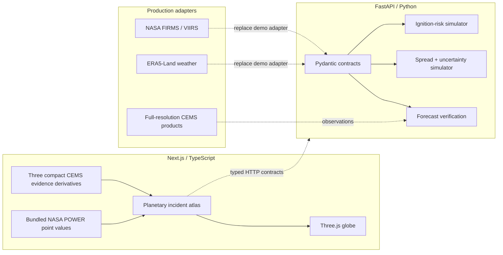

# Ember Atlas

[](https://marinjursic.github.io/EmberAtlas/)
[](https://github.com/MarinJursic/EmberAtlas/actions/workflows/pages.yml)
[](https://nextjs.org/)
[](https://www.typescriptlang.org/)
[](https://www.python.org/)
[](#verification)

Ember Atlas is a full-screen planetary incident atlas for exploring historic wildfire
activations and clearly separated research forecasts. The globe—not a panel—is the
primary workspace. It combines three complementary tasks:

1. **Historic incident evidence** locates documented Copernicus Emergency Management
   Service activations and renders compact derivatives of official CEMS burnt-area,
   active-flame, and fire-front vectors.
2. **Research-scenario exploration** displays an illustrative interval for a *new
   detectable fire* over 6-hour, 24-hour, 48-hour, 72-hour, and 7-day horizons.
   It is a deterministic interface fixture, not a calibrated alert probability.
3. **Active-fire spread forecasting** begins after a detection and estimates spread
   direction, arrival-time distribution, affected area, uncertainty, and exposure.

The default view opens on the 2023 Evros activation (`EMSR686`). The incident index
also includes Valparaíso, Chile (`EMSR715`) and Wooroloo / the Perth Hills,
Australia (`EMSR500`). CEMS vector samples and NASA POWER incident-day point values
are checked into the TypeScript data layer as compact deterministic derivatives, so
the atlas works without credentials, runtime tile services, or hidden downloads.

> **Scientific and safety boundary:** Ember Atlas is a research demonstration, not an
> operational fire-alert, evacuation, or incident-command system. Historic
> locations, activation identifiers, mapped areas, perimeter shapes, and the Evros
> active-flame/front evidence derive from the exact public CEMS vector packages
> listed below. Incident-day point meteorology comes from cited NASA POWER/MERRA-2
> responses. Geometry is sampled and magnified for globe legibility, scalar context
> dots are normalized encodings rather than raw grids, and every forecast remains an
> authored research scenario. Nothing is current or suitable for emergency decisions.

## Planetary atlas interaction

- Drag in any direction to rotate freely across both poles; orientation is stored as
  a normalized quaternion and has no artificial polar clamp.
- Scroll or pinch to zoom within bounded full-Earth and incident-inspection ranges.
- Use arrow keys to rotate, `+` / `-` to zoom, `Home` or `F` to refocus, and `R` to
  reset the full Earth.
- Use visible **Focus**, **Full Earth**, **Reset**, and zoom buttons when drag input
  is unavailable.
- Select Greece, Chile, or Australia from the incident index. Projected labels track
  their latitude/longitude and disappear when they move behind the globe.
- Scrub the bottom model filmstrip. Solid amber is a shape-preserving sample of the
  selected CEMS perimeter; dashed red is an illustrative p50 scenario; cyan is its
  uncertainty envelope.
- Open the provenance ledger at any time. It explicitly identifies the app as a
  historic, cached, non-live replay.

## Continuous app walkthrough

[](docs/walkthrough/app-walkthrough.mp4)

[Watch or download the full-resolution MP4](docs/walkthrough/app-walkthrough.mp4)
· [Open the walkthrough poster](docs/walkthrough/app-walkthrough-poster.jpg)

This is one uninterrupted recording of the executable atlas. It opens on the full
NASA-textured Earth at Evros, orbits across continents and latitude, zooms and
returns to Full Earth, changes the scenario horizon, toggles historic-day wind,
replays the incident timeline, refocuses on Valparaíso, opens the accessible
source ledger, and switches theme.
Every state transition is rendered by the running application.

## What you can do

- Orbit a full-viewport Three.js globe freely across both poles and all longitudes.
- Move among three geographically distinct historic CEMS activations.
- Switch between a high-contrast dark control-room theme and a readable daylight
  theme; the choice persists in local storage and defaults to the operating-system
  preference on first use.
- Change the ignition-risk horizon and watch the illustrative interval update across
  6-hour, 24-hour, 48-hour, 72-hour, and 7-day windows under a repeated 24-hour
  hazard assumption.
- Toggle eight independent renderer layers: NASA POWER incident-day wind vectors;
  normalized temperature, soil-wetness, and derived-dryness context; CEMS mapped
  evidence points; scenario uncertainty; a filled CEMS burn-area shape; and the
  explicitly synthetic asset-at-risk test.
- Read the quantitative legend in units: °C, 0–1 surface-soil-wetness fraction,
  derived 0–1 dryness (`1 − wetness`), and 10 m wind in m/s with meteorological
  *from* direction in degrees. Wind arrows point downwind.
- Play or scrub each six-step observation sequence.
- Compare the p50 forecast outline with the observation outline while affected area,
  settlement, road, power-line, forest, protected-area, IoU, and arrival-time metrics
  update together.
- Query typed FastAPI endpoints for risk, spread, story events, and verification.
- Inspect OpenAPI documentation and run deterministic regression tests.

### Interaction and accessibility

- Drag or swipe horizontally and vertically; two-finger pinch and mouse-wheel zoom
  share the same bounded camera contract.
- Focus the globe and use the arrow keys to orbit; press `Home` / `F` to return to
  the active incident or `R` to reset Earth.
- Use the left/right arrow keys while a horizon tab is focused to change horizon.
- Every layer control exposes an `aria-pressed` state, every icon-only control has an
  accessible name, keyboard focus is visible, and verification metrics remain
  available in the mobile layout.
- The provenance ledger behaves as a modal dialog: focus moves into it, remains
  contained while open, closes with Escape, and returns to the invoking control.
- Reduced-motion preference removes inertial and focus interpolation.
- If WebGL is unavailable, the app reports that condition while leaving all textual
  forecasts, controls, and metrics usable.

### Geographic and visual correctness

- The globe surface uses a locally bundled 4096 × 2048 derivative of NASA’s
  **Blue Marble: Next Generation** imagery, with anisotropic filtering and mipmaps
  for stable detail during orbit and zoom. Full attribution is recorded in
  [`THIRD_PARTY_NOTICES.md`](THIRD_PARTY_NOTICES.md).
- Country/coastline geometry comes from **Natural Earth 1:110m Admin-0 countries
  v4.1.0**, converted through `world-atlas@2`; the renderer no longer invents
  procedural continent shapes.
- Long segments crossing the ±180° date line are deliberately split so they cannot
  draw a false chord through the globe.
- Every event marker and its incident-specific synthetic asset fixture use the same
  latitude/longitude-to-sphere transform as the country boundaries. The infrastructure
  geometry is deliberately labeled as an interaction fixture, not an authoritative
  road, utility, or facility inventory.
- Burn-perimeter lines preserve samples of official CEMS polygon exteriors. Local
  tangent-plane display magnification is explicit in the inspector: 8× for Evros,
  18× for Valparaíso, and 14× for Wooroloo. Magnification makes small incident
  footprints legible on a full-Earth canvas; it does not change the displayed CEMS
  area statistic.
- Evros includes all 40 photo-interpreted active-flame coordinates in CEMS Monitoring
  02 plus compact samples of mapped fire-front lines. The other two cases label
  their points as official burn-polygon representative/boundary samples—not thermal
  detections.
- Grid parallels are true spherical latitude circles. Meridians share the globe
  radius and rotation center.
- ACES filmic tone mapping, a low-opacity ocean sheen, a restrained atmospheric
  limb, and separate ambient, key, and rim lights preserve Earth’s surface form
  while keeping the synthetic forecast overlays visually distinct.
- Natural Earth’s default country theme is a **de facto boundary viewpoint**. It is
  appropriate for a small global overview, not cadastral work or a legal statement
  about disputed boundaries.

## Architecture



### Frontend

- **Next.js 16 + React 19 + TypeScript**
- **Three.js** for a real WebGL globe, atmospheric shell, geospatial grid, compact
  CEMS evidence, Natural Earth country boundaries, scenario uncertainty, and
  incident-day wind vectors
- SSR product shell with a client-only WebGL scene
- Responsive layouts for desktop, tablet, and mobile
- Keyboard-accessible globe and controls, persistent light/dark theme, reduced-motion
  behavior, and WebGL fallback
- No external tiles, fonts, keys, cookies, trackers, or runtime CDNs

### API

- **FastAPI + Pydantic v2** with generated OpenAPI documentation
- Strict coordinates, horizons, probabilities, and input bounds
- Stable SHA-256-derived location jitter and a fixed replay timestamp, making complete
  default responses byte-for-byte reproducible
- Directional ellipse spread model with p50 and p90 perimeter contracts
- Spherical destination geometry that remains valid at the poles and date line
- Exposure summaries and monotonic replay-verification metrics
- Explicit provenance and caveat fields in every forecast response

### Why runtime behavior is deterministic

An operational system depends on satellite availability, cloud cover, weather
latency, licensing/quotas, and substantial geospatial preprocessing. This repository
precomputes small, reviewable evidence derivatives from public files and never polls
them at runtime. That makes the app work offline and makes evidence rendering
reproducible. Forecast endpoints remain deterministic synthetic adapters, with typed
request/response shapes that production data and model services could replace.

### Historic evidence provenance

| Case | Bundled historic evidence | Exact public product | Incident-day meteorology |
| --- | --- | --- | --- |
| Evros 2023 | 48-point sampled perimeter, all 40 mapped active flames, compact fire-front samples, 93,511.0 ha | [EMSR686 Monitoring 08 vectors](https://rapidmapping.emergency.copernicus.eu/backend/EMSR686/AOI01/DEL_MONIT08/EMSR686_AOI01_DEL_MONIT08_v1.zip) and [Monitoring 02 vectors](https://rapidmapping.emergency.copernicus.eu/backend/EMSR686/AOI01/DEL_MONIT02/EMSR686_AOI01_DEL_MONIT02_v3.zip) | [NASA POWER 23 Aug 2023 UTC JSON](https://power.larc.nasa.gov/api/temporal/daily/point?parameters=T2M%2CWS10M%2CWD10M%2CGWETTOP&community=AG&longitude=25.86&latitude=40.93&start=20230823&end=20230823&format=JSON&time-standard=UTC) |
| Valparaíso 2024 | sampled exteriors of the two largest official polygons, 24 representative points, 8,718.2 ha | [EMSR715 AOI01 delineation vectors](https://rapidmapping.emergency.copernicus.eu/backend/EMSR715/AOI01/DEL_PRODUCT/EMSR715_AOI01_DEL_PRODUCT_v2.zip) | [NASA POWER 05 Feb 2024 UTC JSON](https://power.larc.nasa.gov/api/temporal/daily/point?parameters=T2M%2CWS10M%2CWD10M%2CGWETTOP&community=AG&longitude=-71.47&latitude=-33.05&start=20240205&end=20240205&format=JSON&time-standard=UTC) |
| Wooroloo 2021 | sampled largest official perimeter and 16 boundary samples, 10,671.8 ha | [EMSR500 Monitoring 01 vectors](https://cems-mapping-website.s3.eu-west-1.amazonaws.com/static/activations/EMSR500/EMSR500_AOI01_DEL_MONIT01_r1_RTP01_v1_vector.zip) | [NASA POWER 02 Feb 2021 UTC JSON](https://power.larc.nasa.gov/api/temporal/daily/point?parameters=T2M%2CWS10M%2CWD10M%2CGWETTOP&community=AG&longitude=116.32&latitude=-31.8&start=20210202&end=20210202&format=JSON&time-standard=UTC) |

NASA POWER returns source-native-resolution daily MERRA-2/POWER values. The bundle
stores 2 m temperature, 10 m wind speed and meteorological-from direction, and
surface soil wetness. Those point values provide incident-day context; they are not
station observations or a spatial fire-weather field.

## Repository map

```text
.
├── app/                       Next.js route, metadata, and global visual system
├── components/
│   ├── GlobeScene.tsx         Three.js rendering, projection, and interaction
│   ├── globe/
│   │   └── ArcballController.ts  Quaternion rotation, inertia, focus, and zoom
│   └── WildfireDashboard.tsx  Atlas rails, inspector, provenance, and filmstrip
├── lib/
│   ├── contracts.ts           Frontend domain types
│   ├── historic-evidence.ts   Compact CEMS geometry + NASA POWER values
│   ├── incidents.ts           Three replay artifacts and source manifests
│   └── story.ts               Forecast/risk transforms
├── backend/
│   ├── app/
│   │   ├── main.py            FastAPI routes and CORS
│   │   ├── models.py          Validated Pydantic contracts
│   │   └── simulation.py      Risk, spread, and verification models
│   └── tests/                 API and scientific-invariant tests
├── docs/walkthrough/          Continuous application GIF, MP4, and poster
├── tests/                     SSR and project-integrity tests
├── scripts/smoke.sh           Running frontend/API integration check
└── public/og.png              Product social card for link previews
```

## Quick start

### Prerequisites

- Node.js 22.13 or newer
- npm 10 or newer
- Python 3.11 or newer

### 1. Install and run the web app

```bash
npm ci
npm run dev
```

Open [http://localhost:3000](http://localhost:3000).

### 2. Install and run the API

In another terminal:

```bash
cd backend
python3 -m venv .venv
source .venv/bin/activate
pip install -e '.[dev]'
uvicorn app.main:app --reload --port 8000
```

Open [http://localhost:8000/docs](http://localhost:8000/docs) for Swagger UI.

No `.env` file or external credential is required.

## API

### Health

```bash
curl http://localhost:8000/health
```

### Ignition risk

```bash
curl -X POST http://localhost:8000/v1/ignition-risk \
  -H 'Content-Type: application/json' \
  -d '{
    "location": {"latitude": 40.93, "longitude": 25.86},
    "horizon": "24h",
    "vegetation_dryness": 0.78,
    "wind_speed_kph": 33,
    "soil_moisture": 0.16
  }'
```

The probability interval is ordered and bounded in `[0, 1]`; larger time horizons
increase cumulative event probability for fixed conditions.

### Spread forecast

```bash
curl -X POST http://localhost:8000/v1/spread-forecast \
  -H 'Content-Type: application/json' \
  -d '{
    "event_id": "evros-2023",
    "forecast_hours": 24,
    "wind_speed_kph": 33,
    "wind_direction_degrees": 86,
    "fuel_dryness": 0.78,
    "slope_degrees": 8
  }'
```

The response includes closed p50 and p90 perimeter rings, an ordered p10/p50/p90
arrival-time distribution, expected area, direction, coverage target, model version,
caveat, and exposure estimates for
settlements, roads, power lines, forest, and protected areas. Requests for an event
outside the built-in catalogue return `404` instead of fabricating a story forecast.

### Verification

```bash
curl 'http://localhost:8000/v1/verification/evros-2023?forecast_hour=24'
```

### Endpoint summary

| Method | Path | Purpose |
| --- | --- | --- |
| `GET` | `/health` | Readiness and runtime mode |
| `GET` | `/v1/events` | Built-in story catalogue |
| `POST` | `/v1/ignition-risk` | Calibrated cell risk |
| `POST` | `/v1/spread-forecast` | Spread, uncertainty, and exposure |
| `GET` | `/v1/verification/{event_id}` | Forecast/observation metrics |

## Verification

Frontend:

```bash
npm run verify
```

Or run each frontend stage independently:

```bash
npm run typecheck
npm run lint
npm run build
npm test
```

Backend:

```bash
cd backend
source .venv/bin/activate
ruff check .
pytest
```

With both development servers running:

```bash
./scripts/smoke.sh
```

The automated suite currently contains 38 frontend/domain/component tests and
14 Python tests. It checks:

- server-rendered product content and metadata;
- real horizon-sensitive probability behavior for every story frame;
- keyboard horizon navigation, all eight layer toggles, methodology disclosure,
  replay play/pause, timeline scrubbing, and persistent accessible theme switching;
- replacement of procedural continents with Natural Earth boundaries and explicit
  date-line splitting;
- closure, coordinate bounds, exact source resolution, and unit bounds for every
  bundled CEMS/NASA POWER evidence record, including all 40 Evros flame points;
- complete exposure coverage for settlements, roads, power lines, forest, and
  protected areas;
- coordinate, timestamp, unknown-field, query-bound, method, and unknown-event errors;
- byte-for-byte deterministic default ignition responses;
- monotonic horizon behavior, closed p50/p90 perimeters, polar/date-line geometry,
  uncertainty expansion, and forecast-verification improvement.

`npm audit --audit-level=moderate` is also expected to report zero known
vulnerabilities for the locked dependency graph.

## Model notes

### Ignition-risk demonstration

The service combines normalized dryness, 10 m wind, inverse soil moisture, and a
small stable location perturbation. A logistic transform maps the latent score to a
24-hour fixture value. The other horizons use the cumulative-event transform
`1 - (1 - p24)^(hours/24)`, so a fixed set of conditions is strictly monotonic across
the five horizons. This transform assumes the same independent 24-hour hazard repeats
through the selected window; it is not a learned temporal forecast. The interval width
grows modestly with the point estimate. The displayed Brier score and expected
calibration error are fixed demonstration metadata, not results from a new empirical
benchmark.

A serious model comparison would include:

- Historical climatology and Fire Weather Index baselines
- Gradient-boosted trees
- ConvLSTM or temporal transformers
- Spatiotemporal graph models
- Calibrated ensembles or conformal prediction

Evaluation should report Brier score, precision–recall, expected calibration error,
false alarms per area, lead-time performance, and geographic/seasonal breakdowns.

### Spread demonstration

The spread endpoint builds a directional ellipse from duration, wind, fuel dryness,
and slope. The p90 ring is an expanded geometry representing the target coverage,
not a learned posterior. A production version could compare cellular automata,
graph models, neural operators, and physics-informed ensembles. Relevant metrics
include IoU, boundary distance, arrival-time error, affected-area error, and
empirical coverage of the uncertainty region.

## Production evolution

The laptop-friendly path would precompute global risk tiles and compute only a
selected region interactively:

1. Ingest FIRMS archive/NRT fire points and attach observation-quality metadata.
2. Build ERA5/ERA5-Land features in Zarr or Cloud-Optimized GeoTIFFs.
3. Add vegetation/burn-scar features from Sentinel or HLS products.
4. Train spatially and temporally held-out baselines before neural models.
5. Calibrate by biome, season, horizon, and sensor availability.
6. Store event perimeters and assets in PostGIS/Parquet.
7. Serve raster/vector tiles from an object store and regional forecasts from FastAPI.
8. Verify every forecast against later science-quality observations.

Operationalization would also require alert governance, sensor-latency handling,
model monitoring, human review, accessibility/localization, security review,
incident-command integration, and clear liability boundaries.

## Limitations

- Historic perimeter/evidence geometry is a compact derivative of downloaded CEMS
  products, not a redistribution of full-resolution source data. Equal-distance
  samples and explicit cartographic magnification preserve recognizability, not
  survey-grade scale or topology.
- NASA POWER values are daily gridded reanalysis context at a single point, not local
  station observations. Temperature/wetness/dryness dots are normalized visual
  encodings and must not be read as a spatial meteorology field.
- Country boundaries are generalized Natural Earth 1:110m v4.1.0 geometry; tiny
  islands and local coastline detail are intentionally omitted at this global display
  scale. Natural Earth’s newer upstream revisions are not yet bundled by
  `world-atlas@2`.
- Natural Earth’s default de facto boundary worldview is not a neutral legal
  adjudication of disputed territories.
- No topography, fuel map, suppression action, spotting, fire-atmosphere coupling,
  or cloud/smoke detection model is present.
- A directional ellipse cannot represent complex terrain-driven fronts.
- The displayed risk interval is illustrative. This demo does not contain a fitted
  calibration dataset, and the horizon transform assumes a repeated independent
  24-hour hazard.
- Scenario-filmstrip area/progress, forecast, verification, and asset-exposure values
  remain authored deterministic fixtures. Only the separately labeled historic
  evidence card, mapped geometry, evidence points, and incident-day weather values
  have the source provenance documented above.
- IoU and arrival-time error follow deterministic replay curves; they are not a
  published evaluation result.
- The web app does not poll live sources and remains intentionally safe to demo offline.
- Lightning is explicitly marked unavailable for the cached event instead of being
  synthesized or silently implied.

## Data and research references

Primary and official references used to shape the product:

- [Natural Earth 1:110m cultural vectors](https://www.naturalearthdata.com/downloads/110m-cultural-vectors/) —
  the upstream Admin-0 country-geometry family used by the globe; Natural Earth
  documents the generalization level and default de facto boundary viewpoint. The
  app’s `world-atlas@2` redistribution specifically packages Natural Earth v4.1.0.
- [Natural Earth disputed-boundaries policy](https://www.naturalearthdata.com/about/disputed-boundaries-policy/) —
  explains the default worldview and the availability of alternate point-of-view
  datasets.
- [NASA Blue Marble: Next Generation](https://svs.gsfc.nasa.gov/3615/) —
  the credited global surface image bundled as a 4K derivative for a realistic,
  offline-capable Earth texture.
- [NASA FIRMS overview](https://wiki.earthdata.nasa.gov/spaces/FIRMS/pages/32079892/Fire%2BInformation%2Bfor%2BResource%2BManagement%2BSystem%2BFIRMS) —
  global MODIS and VIIRS active-fire locations; near-real-time detections use the
  VIIRS 375 m Fire and Thermal Anomalies algorithms.
- [NASA VIIRS Collection 2 375 m Active Fire Product guide](https://www.earthdata.nasa.gov/s3fs-public/2024-07/VIIRS_C2_AF-375m_User_Guide_1.0.pdf) —
  product behavior, formats, and the distinction between near-real-time and
  science-quality streams.
- [NASA FIRMS active-fire downloads](https://firms.modaps.eosdis.nasa.gov/active_fire/) —
  current delivery formats and the recommendation to use standard products for
  latency-insensitive scientific analysis.
- [NASA POWER Daily API](https://power.larc.nasa.gov/docs/services/api/temporal/daily/) —
  the official API contract used to bundle source-native-resolution daily 2 m
  temperature, 10 m wind, wind direction, and surface-soil-wetness point values.
- [NASA POWER wind methodology](https://power.larc.nasa.gov/docs/methodology/meteorology/wind/) —
  documents MERRA-2-derived wind parameters and the meteorological convention that
  direction is where wind comes from, clockwise from north.
- [Copernicus Climate Data Store: ERA5-Land hourly data](https://cds.climate.copernicus.eu/datasets/reanalysis-era5-land?tab=overview) —
  hourly global land variables at 0.1° distribution / 9 km native resolution.
- [Copernicus EMSR686 Monitoring 08 vectors](https://rapidmapping.emergency.copernicus.eu/backend/EMSR686/AOI01/DEL_MONIT08/EMSR686_AOI01_DEL_MONIT08_v1.zip) —
  Evros burnt-area perimeter and 93,511.0 ha mapped-area source.
- [Copernicus EMSR686 Monitoring 02 vectors](https://rapidmapping.emergency.copernicus.eu/backend/EMSR686/AOI01/DEL_MONIT02/EMSR686_AOI01_DEL_MONIT02_v3.zip) —
  source for 40 active-flame points and mapped fire fronts rendered in the case.
- [Copernicus EMSR715 AOI01 delineation vectors](https://rapidmapping.emergency.copernicus.eu/backend/EMSR715/AOI01/DEL_PRODUCT/EMSR715_AOI01_DEL_PRODUCT_v2.zip) —
  Valparaíso burnt-area polygons and 8,718.2 ha mapped total.
- [Copernicus EMSR500 Monitoring 01 vectors](https://cems-mapping-website.s3.eu-west-1.amazonaws.com/static/activations/EMSR500/EMSR500_AOI01_DEL_MONIT01_r1_RTP01_v1_vector.zip) —
  Wooroloo burnt-area polygon and 10,671.8 ha mapped total.
- [Copernicus: European State of the Climate 2023 wildfires](https://climate.copernicus.eu/esotc/2023/wildfires) —
  context for the approximately 96,000 ha Alexandroupolis event.
- [Copernicus EMS activation EMSN166](https://mapping.emergency.copernicus.eu/activations/EMSN166/) —
  post-fire damage assessment and downloadable geospatial products.

## License

This demonstration code is provided for portfolio and educational use. The repository
bundles a credited NASA Blue Marble derivative, Natural Earth geometry, and small
coordinate/value derivatives from the cited CEMS and NASA POWER responses as
described in [`THIRD_PARTY_NOTICES.md`](THIRD_PARTY_NOTICES.md). Full operational
datasets are not redistributed; consult each official source for current license,
attribution, and acceptable-use requirements.
